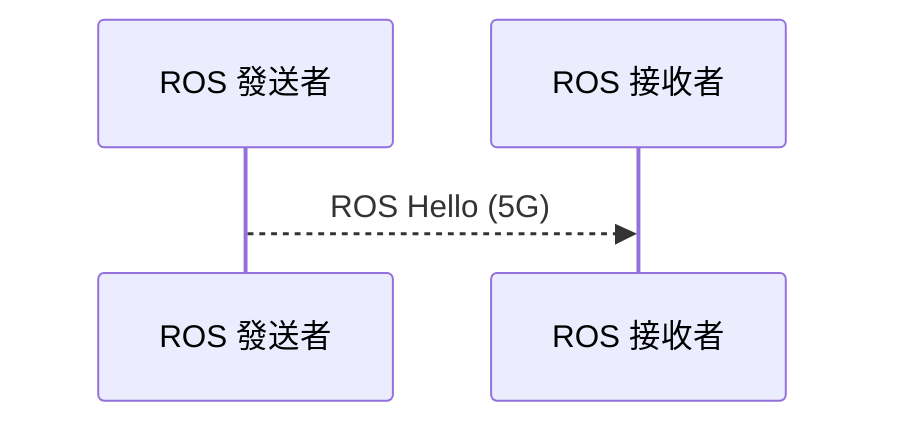
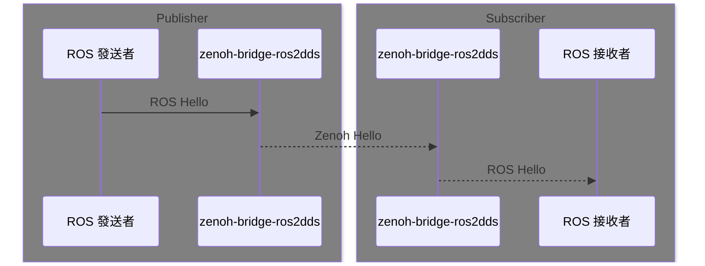
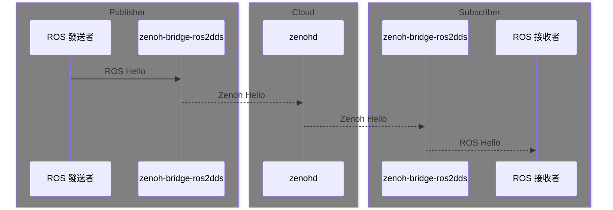

# 使用 Zenoh 實現 ROS 跨網域傳輸

撰寫人：林祥瑞，國立臺灣大學 資訊工程研究所 NEWSLab

## 概論

本文目的是實現 ROS 節點之間的網域傳輸，最簡單的情況是一個 ROS 2 發送者
和向一個接收者打招呼訊息。本文介紹一個將 ROS 訊息轉換稱 Zenoh 訊息後、
穿透無線網路到對方再轉回 ROS 訊息的方法，做法上不會更動原有的 ROS 程式，
因此網路的連接邏輯和一般 ROS 做法一樣。



而實際上的連接順序如下，做法是在兩邊的電腦各自開啓
zenoh-bridge-ros2dds 的橋，只要讓兩邊的橋接通即可讓兩邊的 ROS 節點互相
發現對方。




執行流程大致是

1. 確保兩臺電腦網路上可接通，最簡單的情況是兩者都在同個子網域，複雜的
   情況可以開第三方轉送，後文會一起介紹。
2. 兩邊電腦各自安裝並啓動 zenoh-bridge-ros2dds，兩電腦在同子網域通常不
   加參數即可自動偵查並互聯，複雜情況設定主動連接方式。
3. 兩邊各自啓動 ROS 節點即可使用。


## 環境設定

這邊示範兩臺電腦的環境使用如下配置

- 作業系統 Ubuntu 22.04
- ROS 2 Humble，建議參考官方的[安裝教學](https://docs.ros.org/en/humble/Installation/Ubuntu-Install-Debians.html)設定。
- zenoh-bridge-ros2dds 0.10.1-rc，參考官方 GitHub README 的 [Linux
  Debian](https://github.com/eclipse-zenoh/zenoh-plugin-ros2dds?tab=readme-ov-file#linux-debian)
  的兩行指令安裝即可，不用手工編譯。

下面有範例是在使用兩臺以外的第三方電腦，環境相同之外多安裝 zenohd。

- zenohd 0.10.1-rc，參考官方 GitHub README 的 [Linux
  Debian](https://github.com/eclipse-zenoh/zenoh?tab=readme-ov-file#linux-debian)
  的兩行指令安裝即可，不用手工編譯。


## 範例一：共同子網域（被動橋接）

爲了方便說明，假設發送者及接收者 IP 分別是 192.168.0.100 及 192.168.0.200。

1. 發送者及接收者各自開啓橋接程式。
  ```bash
  zenoh-bridge-ros2dds
  ```

2. 發送者啓動 ROS talker。

  ```bash
  source /opt/ros/humble/setup.zsh
  ros2 run demo_nodes_cpp talker
  ```

3. 接收者啓動 ROS listener。

  ```bash
  source /opt/ros/humble/setup.zsh
  ros2 run demo_nodes_cpp listener
  ```

順利的情況下接收者的 listener 會顯示如下收到來自 talker 的訊息。

```
[INFO] [1710889871.982803541] [listener]: I heard: [Hello World: 1]
[INFO] [1710889872.982691972] [listener]: I heard: [Hello World: 2]
[INFO] [1710889873.982733232] [listener]: I heard: [Hello World: 3]
...
```

如果情況不順利，請繼續下個段落。


## 範例二：共同子網域（主動橋接）

同樣假設發送者及接收者 IP 分別是 192.168.0.100 及 192.168.0.200，這邊
做法上和範例一大同小異，差別僅有在啓動 zenoh-bridge-ros2dds 的時候、會
讓一方主動用IP找到到另一方，程式參數修改方式如下。

接收者啓動時添加 -l 參數、使其在 TCP 7447 埠口準備接收外來連線。

```bash
zenoh-bridge-ros2dds -l tcp/192.168.200:7447
```

發送者啓動時添加 -e 參數、使其在啓動時主動連接接收者的 TCP 7447 埠口。

```bash
zenoh-bridge-ros2dds -e tcp/192.168.200:7447
```

上述步驟的目的是讓發送者透過 IP 主動連結接收者，如此一來，兩邊的 ROS
topic 即可透過這個連互相轉知給對方。

後續的 ROS talker/listener 的步驟和範例一是相同的。


## 範例三：跨網域或兩者無法互相連接

這個情況常發送在手機電信網路、兩方都無法獲取固定 IP 的情況，這邊的做法
是找一臺有固定 IP 的雲端伺服器當作第三方轉送者，讓發送及接收方都連接第
三方來建立連接，使用第三方連接的流程圖如下。




假設發送者、接收者、第三方 IP 分別是 192.168.1.100、192.168.2.200、
192.168.3.300。

首先在雲端第三方開啓 zenohd 並啓用主動監聽。

```bash
zenohd -l tcp/192.168.3.300:7447
```

發送者、接收者啓動橋接程式時，都主動連接 zenohd。

```bash
zenoh-bridge-ros2dds -e tcp/192.168.3.300:7447
```

後續 ROS talker/listener 流程相同。


## 自訂化選項

Zenoh 除了提供跨網域傳輸能力，它還有提供數個自訂化的選項可以調整，這邊
表列幾個實用功能。


### 使用非 TCP 協定

Zenoh 支援 UDP、TLS、QUIC等協定，這些選項都可套用在 zenohd 及所有的 zenoh-bridge-* 的套件。

```bash
zenoh-bridge-ros2dds -e udp/192.168.1.100:7447
zenoh-bridge-ros2dds -e tls/192.168.1.100:7447
zenoh-bridge-ros2dds -e quic/192.168.1.100:7447
```

### 更多類型的橋接

除了 ROS 2 之外，還支援 ROS 1 及 MQTT 的橋接程式，若你走過前面段落的環
境設定，在 Ubuntu 上可直接安裝橋接程式，用法和 zenoh-bridge-ros2dds 大
同小異。

```bash
sudo apt install zenoh-bridge-mqtt
sudo apt install zenoh-bridge-ros1
```

### 綁定 ROS Namespace

當情況是兩臺電腦執行同樣一組 ROS 程式，而有兩邊 ROS topic 有撞名的風險，
解決方式是可以在兩邊設定不同的 namespace 來避免撞名。下面範例我們假設
兩臺電腦都是車子，分別命名爲 car1 及 car2，兩者都有一個同名的 topic 是
camera。

第一臺車綁定 car1 namespace。

```bash
zenoh-bridge-ros2dds -n car1
```

第二臺車綁定 car2 namespace。

```bash
zenoh-bridge-ros2dds -n car2
```

如此一來，car1 及 car2 的 topic 在 Zenoh 網路轉送時，分別被重新命名爲
car1/camera 及 car2/camera，這樣即可避免撞名問題。

### 綁定 ROS Domain ID

若 ROS 程式被設定在特定的 ROS Domain 執行，例如

```bash
export ROS_DOMAIN_ID=7
ros2 run demo_nodes_cpp talker
  ```

爲了讓橋接程式可以正確偵查到特定 ROS domain，必須添加對應的參數。

```bash
zenoh-bridge-ros2dds -d 7
```
